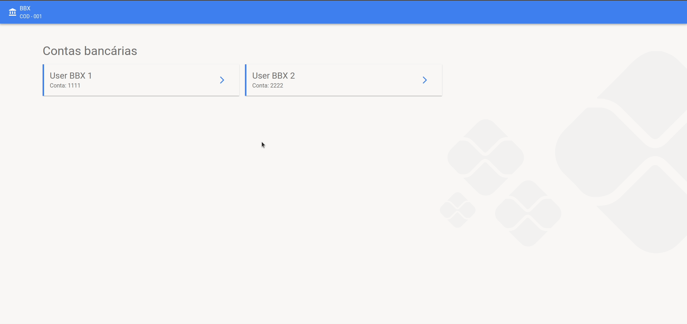
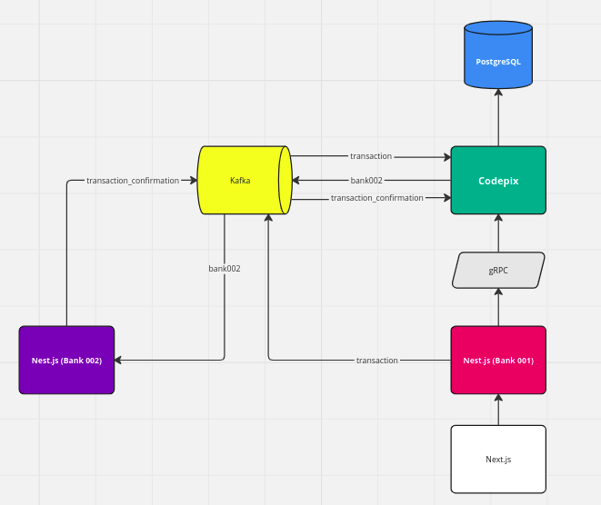

# Codepix



## 💻 Sobre o Projeto

O Codepix é um software que intermedia transações financeiras assim como o PIX original.

O objetivo do projeto é criar um sistema capaz de realizar transações financeiras através de chaves Pix (cpf ou email) para contas do mesmo banco ou até bancos diferentes.

Cada conta pode cadastrar diversas chaves pix para utilização nas transferências.


## Arquitetura

A arquitetura é baseada em eventos por conta das necessidades de comunicação assíncrona (notificando um serviço mesmo que esteja fora do ar) e integridade das mensagens.



## 🛠 Tecnologias

- Node.js
- Next.js
- Kafka
- gRPC
- Docker

# 🚀 Como Executar o Projeto

Podemos considerar este projeto como sendo divido em 4 partes:

1. Inicialização do Kafka, zookeeper e control-center (pasta `kafka`).
2. Inicialização do "banco central" (pasta `codepix`).
3. Inicialização das APIs dos bancos (pasta `server`).
4. Inicialização da dashboard dos bancos (pasta `web`).

## Pré-requisitos

Antes de começar, você vai precisar ter instalado em sua máquina o [Docker](https://www.docker.com). Além disto é bom ter um editor para trabalhar com o código como [VSCode](https://code.visualstudio.com)

## 1. Kafka

Inicialização do Kafka, geração dos tópicos e visualização das informações do kafka no control-center (http://localhost:9021).

```bash
cd kafka
docker-compose down   # Para desfazer quaisquer configurações
docker-compose up -d
```

## 2. Codepix

Inicialização da aplicação central, que coordena a confirmação de transações e geração de chaves pix.

```bash
cd codepix
docker-compose down
docker-compose up -d
docker exec -it codepix_app_1 bash

npm run start all
```

## 3. Server

Inicialização das APIs dos bancos com o Nest.js.

```bash
cd server
docker-compose down
docker-compose up -d
docker exec -it -u root server_app_1 bash
```

### Banco 1 (BBX)

1. Execute as fixtures de dados demo.

```bash
BANK_CODE=001 npm run console fixtures
```

2. Inicie o servidor de produção.

```bash
BANK_CODE=001 npm run build
BANK_CODE=001 npm run start:prod
```

### Banco 2 (CTDER)

1. Execute as fixtures de dados demo.

```bash
BANK_CODE=002 npm run console fixtures
```

2. Inicie o servidor de produção.

```bash
BANK_CODE=002 npm run build
BANK_CODE=002 npm run start:prod
```

## 4. Web

Inicialização das APIs dos bancos com o Nest.js.

```bash
cd web
docker compose down
docker compose up -d
docker exec -it -u root web-app-1 bash
```

### Banco 1 (BBX)

```bash
npm run 001:build
npm run 001:start
```

### Banco 2 (CTDER)

```bash
npm run 001:build
npm run 002:start
```

Agora, as aplicações web estarão em http://localhost:8000 (banco BBX) e http://localhost:8001 (banco CTDER)